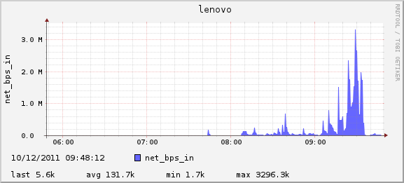

=====================
linux-stats-dashboard
=====================

local system monitoring dashboard for linux

* © 2010-2011 `Corey Goldberg <http://goldb.org>`_
* https://github.com/cgoldberg/linux-stats-dashboard

----
Info
----

* collects and graphs basic operating system stats
* stores data in RRD (round-robin database)
* generates .png images of plots/stats
* run this script at regular intervals with a task/job scheduler
* requires: python 2.x, rrdtool, linux 2.6+

------------
Instructions
------------

* configure the script settings:
 
  * **NET_INTERFACE**: network device namde
  * **DISK**: storage device name
  * **INTERVAL**: collection interval in secs (how often the script is run)
  * **GRAPH_MINS**: timespans for graph/png files
  * **GRAPH_DIR**: output directory for png images 
    
    * perhaps under '/var/www/'
    * make sure directory is writable
  
  * **STORAGE_DIR**: output directory for rrd database files
    
    * make sure directory is writable
    
* make the script executable::
    
    $ chmod +x stats2rrd.py

* add an entry to your crontab (crontab -e) so cron will run it.

* example crontab entry using a 60 sec (1 min) interval::

    */1 * * * * /home/corey/linux-stats-dashboard/stats2rrd.py

---------------
Stats Collected
---------------

* **cpu_percent**: processor utilization
* **mem_used**: physical memory usage
* **net_bps_in**: network throughput (bps in)
* **net_bps_out**: network throughput (bps out)
* **load_avg**: system load average (1 min)
* **disk_busy_percent**: disk busy doing i/o

------------
Dependencies
------------

* linux 2.6+
* python 2.x
* rrdtool

-------
License
-------

* This is Free Open Source Software.
* OSI Approved :: `MIT License <http://www.opensource.org/licenses/mit-license>`_

-----------
Screenshots
-----------

